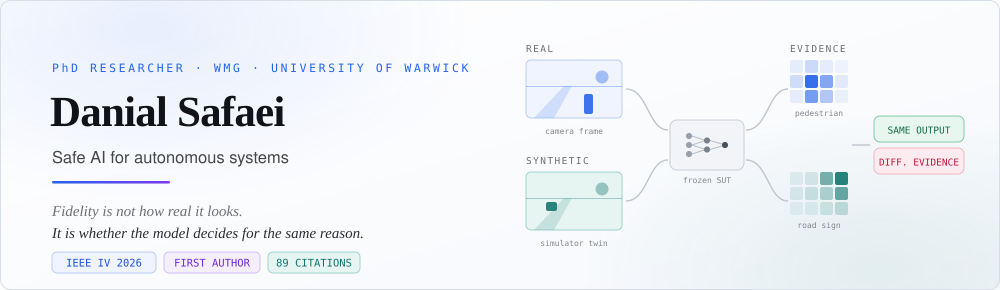

  <picture>
    <source media="(prefers-color-scheme: dark)" srcset="assets/banner-dark.svg">
    <source media="(prefers-color-scheme: light)" srcset="assets/banner-light.svg">
    
  </picture>

  <a href="https://danial-safaei.github.io"><b>Website</b></a> ·
  <a href="https://danial-safaei.github.io/cv.html"><b>CV</b></a> ·
  <a href="https://scholar.google.co.uk/citations?user=qNJPWrMAAAAJ&hl=en"><b>Scholar</b></a> ·
  <a href="https://orcid.org/0000-0002-4443-8763"><b>ORCID</b></a> ·
  <a href="https://www.linkedin.com/in/danial-safaei/"><b>LinkedIn</b></a> ·
  <a href="mailto:danial.safaei@warwick.ac.uk"><b>Email</b></a>

 

## The problem I work on

A driving model sees a real frame and outputs a 20° left turn. It sees the simulator's twin of that frame and outputs the same 20° left turn.

Perfect agreement. Ship it?

Look closer. In the real frame the decision was driven by **a pedestrian**. In the synthetic one, by **a road sign** — while the pedestrian went undetected. Same output, different reason. The test passed for the wrong reason, and no pixel-level or output-level metric can see it happening.

My research makes that failure mode measurable, so safety claims about autonomous systems rest on evidence rather than appearance.

> On one task, calibrating a generator for output agreement alone improved the output score by **74%** while making the decisive evidence **16% more divergent**. The score got better. The reasoning got worse.

 

## Publications

**Quantifying Fidelity: A Decisive Feature Approach to Comparing Synthetic and Real Imagery** 
D. Safaei, S. Khastgir, M. Alirezaei, J. Ploeg, C.-H. Cheng, S. Tong, X. Zhao 
<i>2026 IEEE Intelligent Vehicles Symposium (IV)</i>, pp. 847–854 · Detroit, MI, USA 
[DOI](https://doi.org/10.1109/IV66570.2026.11624013) · [arXiv](https://arxiv.org/abs/2512.16468) · [Code](https://github.com/Danial-Safaei/DFF)

**DeePLT: Personalized Lighting Facilitates by Trajectory Prediction of Recognized Residents in the Smart Home** 
D. Safaei, A. Sobhani, A. A. Kiaei 
<i>International Journal of Information Technology</i>, vol. 16, no. 5, pp. 2987–2999 
[DOI](https://doi.org/10.1007/s41870-023-01665-1) · [arXiv](https://arxiv.org/abs/2304.08027)

Full list including preprints → [Google Scholar](https://scholar.google.co.uk/citations?user=qNJPWrMAAAAJ&hl=en)

 

## Research

| | |
|:--|:--|
| **Safety assurance for AI** | Arguing safety and reliability claims with evidence when learned components operate in high-consequence settings |
| **Explainable evaluation** | Using interpretability methods as measurement instruments — comparing the evidence a model relies on, not only its outputs |
| **Synthetic-data fidelity** | Whether synthetic imagery is faithful to the decision-relevant structure of real data, so simulation results transfer |
| **Scenario-based testing** | Testing autonomous systems against the conditions that matter most for safety |

PhD supervised by Prof. Siddartha Khastgir and Prof. Matthew Higgins at WMG, in industrial partnership with Siemens Digital Industries Software.

 

## Featured repository

### [→ DFF](https://github.com/Danial-Safaei/DFF)
Reference implementation of Decisive Feature Fidelity: counterfactual-XAI decisive maps, ControlNet training wrappers, dataset manifests, and the calibration loop from the IEEE IV 2026 paper. Validated on 2,126 matched KITTI / Virtual KITTI 2 pairs across three frozen systems under test.

 

## Toolkit

**Languages** 

**Deep learning & vision** 

**Autonomy & simulation** 

 

  <picture>
    <source media="(prefers-color-scheme: dark)" srcset="assets/metrics-dark.svg">
    <source media="(prefers-color-scheme: light)" srcset="assets/metrics-light.svg">
    
  </picture>

  <picture>
    <source media="(prefers-color-scheme: dark)" srcset="https://raw.githubusercontent.com/Danial-Safaei/Danial-Safaei/output/github-contribution-grid-snake-dark.svg">
    <source media="(prefers-color-scheme: light)" srcset="https://raw.githubusercontent.com/Danial-Safaei/Danial-Safaei/output/github-contribution-grid-snake.svg">
    
  </picture>

  <i>Beyond visual realism, mechanistic realism is what makes virtual testing trustworthy.</i>

