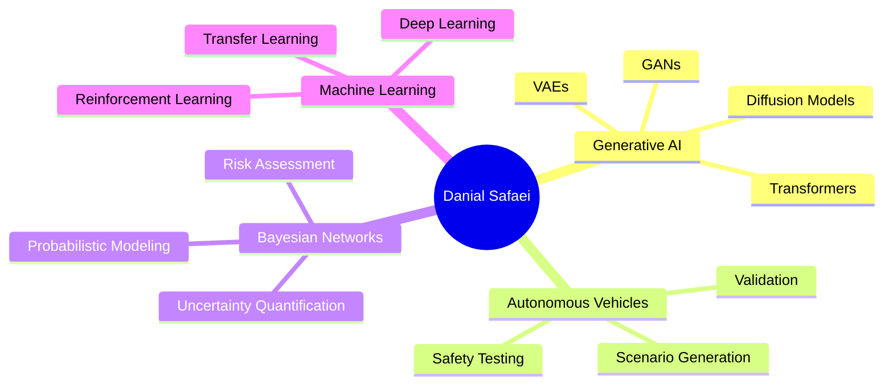

<div align="center">
  
# 🌟 Welcome to My GitHub Universe 🌟


</div>

<div align="center">
  
[](https://git.io/typing-svg)

</div>

<p align="center">
  
  
  
</p>

<div align="center">
  
### 🔗 Connect With Me

[](https://www.linkedin.com/in/danial-safaei-a7a2b917a/)
[](https://scholar.google.com/citations?user=your_scholar_id)
[](https://www.researchgate.net/)
[](https://orcid.org/)
[](mailto:your.email@warwick.ac.uk)

</div>

<br>

## 🎯 About Me


🔬 **PhD Researcher** at the University of Warwick, UK

🚀 Passionate about pushing the boundaries of **Generative AI** and **Autonomous Systems**

🎓 Background in **Computer Engineering** and **Artificial Intelligence**

💡 Expertise in:
- 🤖 **Generative AI & Deep Learning**
- 🚗 **Autonomous Vehicle Systems**
- 🔍 **Safety-Critical Scenario Generation**
- 📊 **Bayesian Networks & Probabilistic Modeling**
- 🧮 **Machine Learning & Data Science**
- 🔬 **Traffic Scenario Analysis & Simulation**

🌱 Currently exploring **cutting-edge AI techniques** for creating realistic, safety-critical scenarios to test and validate autonomous driving systems

💬 Ask me about **generative AI, autonomous vehicles, Bayesian networks, scenario generation, or any AI/ML topic!**

⚡ Fun fact: I love combining theoretical research with practical applications that can save lives!

<br clear="right"/>

## 🔬 Research Focus & Current Projects

<div align="center">

| 🎯 Research Area | 📝 Description | 🔧 Technologies |
|:---:|:---:|:---:|
| **Generative AI for Scenario Generation** | Developing advanced AI models to generate realistic and diverse safety-critical scenarios for autonomous vehicle testing | PyTorch, TensorFlow, GANs, VAEs, Diffusion Models |
| **Fidelity of Synthetic Data** | Investigating methods to ensure synthetic scenarios accurately represent real-world conditions and edge cases | Statistical Analysis, Domain Adaptation, Validation Frameworks |
| **Bayesian Network Modeling** | Creating probabilistic models for uncertainty quantification in autonomous systems | Python, MATLAB, Probabilistic Programming |
| **Safety-Critical Testing** | Designing comprehensive test suites to validate autonomous vehicle behavior in challenging scenarios | ROS, CARLA, SUMO, OpenSCENARIO |

</div>

## 🏆 GitHub Trophies

<div align="center">
  
[](https://github.com/ryo-ma/github-profile-trophy)

</div>

## 💻 Tech Stack & Skills

<details open>
<summary><b>🐍 Programming Languages</b></summary>
<br>


</details>

<details open>
<summary><b>🤖 AI/ML & Deep Learning</b></summary>
<br>


</details>

<details open>
<summary><b>📊 Data Science & Analytics</b></summary>
<br>


</details>

<details open>
<summary><b>🚗 Autonomous Systems & Simulation</b></summary>
<br>


</details>

<details open>
<summary><b>🛠️ Development Tools & Others</b></summary>
<br>


</details>

## 📈 GitHub Analytics

<div align="center">
  
  
</div>

<div align="center">
  
  
</div>

## 📊 Contribution Activity

<div align="center">
  
</div>

## 🐍 Watch My Contribution Snake Eat My Contributions!

<div align="center">
  
</div>

---

## 📚 Featured Research & Publications

<div align="center">

🔬 *Stay tuned for upcoming publications on generative AI and autonomous vehicle safety!*

### Research Interests



</div>

## 🎓 Education & Experience

<details>
<summary><b>📖 Academic Journey</b></summary>
<br>

🎓 **PhD in [Your Department]** - University of Warwick (Current)
- Focus: Generative AI for Safety-Critical Scenario Generation
- Research on Autonomous Vehicle Testing and Validation

🎓 **Master's/Bachelor's in Computer Engineering & AI**
- Specialization in Machine Learning and Artificial Intelligence
- Thesis on Bayesian Networks and Traffic Analysis

</details>

## 💡 What I'm Currently Learning

```python
learning_goals = {
    "2024-2025": [
        "Advanced Diffusion Models for Scenario Generation",
        "Multi-modal AI for Autonomous Systems",
        "Reinforcement Learning from Human Feedback (RLHF)",
        "Large Language Models in Safety-Critical Systems",
        "Edge Computing for Real-time Inference"
    ],
    "tools_exploring": [
        "Stable Diffusion", "LangChain", "JAX", 
        "TensorRT", "CUDA Optimization"
    ]
}
```

## 🤝 Open to Collaboration

I'm always interested in collaborating on:
- 🤖 AI/ML research projects
- 🚗 Autonomous vehicle systems
- 🔬 Academic papers and publications
- 💻 Open-source contributions
- 🎓 Research proposals and grant applications

## 📫 How to Reach Me

<div align="center">

| Platform | Link |
|:---:|:---:|
| 💼 LinkedIn | [Connect with me](https://www.linkedin.com/in/danial-safaei-a7a2b917a/) |
| 📧 Email | your.email@warwick.ac.uk |
| 🎓 Google Scholar | [My Publications](https://scholar.google.com/citations?user=your_scholar_id) |
| 🔬 ResearchGate | [Research Profile](https://www.researchgate.net/) |
| 🆔 ORCID | [ORCID Profile](https://orcid.org/) |

</div>

## ⚡ Quick Stats

<div align="center">


</div>

---

<div align="center">
  
### 💭 Random Dev Quote


</div>

<div align="center">

### ✍️ Latest Blog Posts (Coming Soon!)
<!-- BLOG-POST-LIST:START -->
<!-- BLOG-POST-LIST:END -->

</div>

---

<div align="center">

### 🌟 Show some ❤️ by starring some repositories!


</div>